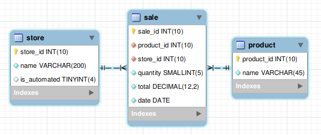

# Описание заданий

## 1. **_Практическое задание по MySQL._**

Архив: **_mysql_sample.rar_**

Внутри архива mysql_sample.zip находится файл sales.sql, который создаст базу данных test с тремя таблицами и заполнит
их данными.

1. Если у вас установлен и запущен mysql 5.7 сервер и клиент, в mysql есть пользователь root с паролем passw, вы
   можете загрузить приложенный файл командой:

   ```mysql -uroot -ppassw < sales.sql```

   После этого можно подключиться к серверу с помощью MySQL Workbench или команды:

   ```mysql -uroot -ppassw test```
2. Если у вас установлен docker, то можно установить и запустить mysql 5.7 так:

   ```docker run --name mysql57 -p 3306:3306 --rm -de MYSQL_ROOT_PASSWORD=passw mysql:5.7```

   загрузить приложенный файл:

   ```docker exec -i mysql57 mysql -uroot -ppassw < sales.sql```

   после этого можно подключиться к серверу с помощью MySQL Workbench или команды:

   ```docker exec -it mysql57 mysql -uroot -ppassw test```

   Для корректного отображения русских букв надо выполнить SQL-запрос: ```set names utf8```

**Описание задания**

База данных test содержит три таблицы: store(склады), product (товары) и sale(продажи). Если с данными в таблицах store,
product все очевидно, то в таблице продаж sale каждая строчка – это данные о продаже товара(product_id), со
склада(store_id), в количестве(quantity), на общую сумму(total) и датой продажи(date).



Таблицы заполнены некоторыми тестовыми данными. Вам дается 10 заданий, в каждом необходимо написать ровно один запрос
SELECT (возможно, с вложенными подзапросами), чтобы получить требуемую выборку. Далее необходимо сравнить результат,
который возвращает ваш SELECT, с тем, что приводится в качестве правильного результата к заданию. Они должны совпадать.

После того как вы напишете все 10 запросов, их нужно добавить в  файл results.sql. Строка каждого запроса должна
располагаться строго под соответствующим комментарием (с его номером). Как будет происходить проверка решения?
Тестовая система содержит аналогичную по структуре базу данных, но с другим набором тестовых данных. Запросы из файла с
вашим решением будут выполнены по одному к базе данных, а результаты сверены с эталонными.
