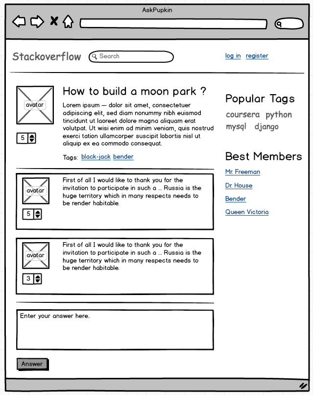

# Описание заданий

## 1. **_Практическое задание по routing._**

В этом задании вы научитесь строить навигацию веб приложения, писать view, которые умеют получать и оперировать
различными параметрами из запроса (параметры из URL, GET параметры, POST параметры), и формировать простые HTTP ответы
с различными статусами.

Для выполнения задания необходимо использовать шаблон проекта https://github.com/alexopryshko/coursera_assignment_tmp

View, которые необходимо отредактировать, находятся в **routing/views.py**, urls - **routing/urls.py**.

Решение должно быть zip архивом. Обратите внимание, что название архива не должно содержать кириллицу и пробелы
(допустимые символы - буквы латинского алфавита и символ нижнего подчеркивания, например: routing.zip,
solution_routing.zip и т.д.) . В архиве должно содержаться два файла, которые вы редактировали ранее (обратите внимание,
название файлов должно быть именно таким): **urls.py, views.py**

1. Нужно написать view **simple_route**, которая формирует http ответ с пустым телом со статусом 200 на запрос GET
   (если запросы отличные от GET - возвращать 405) по /routing/simple_route/:

   **Кейсы:**

   **Замечание**: "-" в столбце "тело" означает, что в грейдере тело не проверяется


| Метод | Путь                     | Статус | Тело     |
| ------------ | ------------------------------ | -------------- | -------------- |
| get        | /routing/simple_route/       | 200          | Пустое |
| get        | /routing/simple_route/blabla | 404          | -            |
| post       | /routing/simple_route/       | 405          | -            |
| put        | /routing/simple_route/       | 405          | -            |

2. **slug_route** - нужно написать view, которая принимает slug и отдает его в теле ответа. В slug допустимы символы:
   0-9, a-z, -, _ . Минимальная длина 1 символ, максимальная длина 16.

   **Кейсы:**


| Метод | Путь                                   | Статус | Тело |
| ------------ | -------------------------------------------- | -------------- | ---------- |
| get        | /routing/slug_route/a-1s_d2/               | 200          | a-1s_d2  |
| get        | /routing/slug_route/1411rwasf123412341234/ | 404          | -        |
| get        | /routing/slug_route/.4/24][/               | 404          | -        |

3. **sum_route** - нужно написать view, которая принимает 2 числа и их суммирует, например /routing/sum_route/1/2/

   **Кейсы:**


| Метод | Путь                 | Статус | Тело |
| ------------ | -------------------------- | -------------- | ---------- |
| get        | /routing/sum_route/1/2/  | 200          | 3        |
| get        | /routing/sum_route/1/-2/ | 200          | -1       |
| get        | /routing/sum_route/1/b/  | 404          | -        |
| get        | /routing/sum_route/a/2/  | 404          | -        |

4. **sum_get_method** - нужно написать view, которая принимает 2 числа из GET параметров a и b и суммирует их.
   Допускается только метод GET. Например /routing/sum_get_method/?а=1&b=2

   **Кейсы:**


| Метод | Путь                          | Статус | Тело |
| ------------ | ----------------------------------- | -------------- | ---------- |
| get        | /routing/sum_get_method/?a=1&b=2  | 200          | 3        |
| get        | /routing/sum_get_method/?a=1&b=-2 | 200          | -1       |
| get        | /routing/sum_get_method/?a=1&b=b  | 400          | -        |
| get        | /routing/sum_get_method/?a=a&b=2  | 400          | -        |
| get        | /routing/sum_get_method/          | 400          | -        |

5. **sum_post_method** - нужно написать view, которая принимает 2 числа из POST параметров a и b и суммирует их.
   Допускается только метод POST. Например /routing/sum_post_method/

   **Кейсы:**


| Путь                  | Парам. | Статус | Тело |
| --------------------------- | ------------- | -------------- | ---------- |
| /routing/sum_post_method/ | a=1&b=2     | 200          | 3        |
| /routing/sum_post_method/ | a=1&b=-2    | 200          | -1       |
| /routing/sum_post_method/ | a=1&b=b     | 400          | -        |
| /routing/sum_post_method/ | a=a&b=2     | 400          | -        |
| /routing/sum_post_method/ | -           | 400          | -        |

## 2. **_Практическое задание по шаблонизации._**

**Часть 1**

В этом задании вы научитесь формировать данные для шаблона (контекст), передавать эти параметры в шаблон и изучите
базовые основы языка шаблонизации **Django**.

Для выполнения задания необходимо использовать шаблон проекта https://github.com/alexopryshko/coursera_assignment_tmp

В **views.py** нужно создать функцию **echo(request)**, которая принимает **request** и возвращает **HttpResponse**
всегда со статусом **200**, а также она должна возвращать эхо, переданных в запросе, параметров и значение заголовка
**X-Print-Statement**. View должна быть доступна по пути **/template/echo/**

View которые необходимо отредактировать находятся в **template/views.py**, template - **template/templates/echo.html**.

Решение должно быть zip архивом. В архиве должно содержаться два файла, которые вы редактировали ранее (обратите
внимание, название файлов должно быть именно таким): **views.py, echo.html**

**Примеры запросов и ответов:**


| Метод | Параметры             | Заголовки       | Ответ                   |
| ------------ | -------------------------------- | -------------------------- | ------------------------------ |
| get        | GET  параметры:  a=1  | -                        | get a: 1 statement is empty  |
| get        | GET  параметры:   c=2 | -                        | get c: 2 statement is empty  |
| post       | POST параметры:  b=1  | -                        | post b: 1 statement is empty |
| post       | POST  параметры:  d=3 | -                        | post d: 3 statement is empty |
| get, post  | -                              | X-Print-Statement = test | statement is test            |
| get, post  | -                              | -                        | statement is empty           |

**Часть 2**

В этом задании вы научитесь создавать темплейт фильтры. Фильтры часто используются на практике, например, когда
необходимо привести данные к конкретному виду (https://docs.djangoproject.com/en/1.11/ref/templates/builtins/),
в частности:

- изменить формат даты
- привести строку к нижнему регистру

Для выполнения задания необходимо использовать шаблон проекта https://github.com/alexopryshko/coursera_assignment_tmp

Templatetags которые необходимо отредактировать находятся в **template/templatetags/extras.py**. Решение должно быть
файлом **extras.py**.

2.1. Фильтр inc. Необходимо в файле **extras.py** создать фильтр “inc“ который принимает 2 аргумента: 1-й - число
которое нужно увеличить, 2-й - на сколько нужно увеличить первое число. Пример использования фильтра “inc“ представлен
в файле template/templates/filters.html

2.2. Тег division. Необходимо в файле **extras.py** создать тег “division“ (то есть тег для деления), который
принимает 3 параметра: 1-ый - делимое,  2-ой - делитель,  3-ий — флаг определяющий тип возвращаемого значения для
результата деления (именованный аргумент to_int). Если переданное значение to_int равно False, необходимо выполнить
вещественное деление. Если передано True результат вещественного деления необходимо привести к целому. Значение
to_int по-умолчанию — False.

Обратите внимание, что делимое и делитель целые числа, но передаются в тег в формате string.

Пример использования тега “division“ представлен в файле template/templates/filters.html

``````

**Часть 3**

В этом задании вы научитесь работать с наследованием шаблонов. Наследование повсеместно используется. Например,
header и footer у сайта одинаковый, не стоит дублировать код header и footer на каждой странице, имеет смысл сделать
базовый шаблон и наследоваться от него.

Для выполнения задания необходимо использовать шаблон проекта https://github.com/alexopryshko/coursera_assignment_tmp

Шаблон, который необходимо отредактировать **template/templates/extend.html**. Решение должно быть файлом **extend.html**.

Нужно написать шаблон которые наследуется от **template/templates/base.html** и переопределяет блоки block_a, block_b.
В блоках block_a, block_b должно остаться, то что было у родительского шаблона и дополнительно вывести параметр “a” и
параметр “b”.

## 3. **_Практическое задание по Django ORM._**

В этом задании вы научитесь работать с ORM

Для выполнения задания необходимо использовать шаблон проекта https://github.com/alexopryshko/coursera_assignment_tmp

Файл, который необходимо отредактировать **db/query.py**. В файле представлены шаблоны функций, которые нужно дополнить.
Решение должно быть файлом **query.py**.

**Предметная область – блоги и топики:**

```
class User(models.Model):
   first_name = models.CharField(max_length=255)
   last_name = models.CharField(max_length=255)

class Blog(models.Model):
   title = models.CharField(max_length=255)
   author = models.ForeignKey(User)
   created = models.DateTimeField(default=timezone.now())

   subscribers = models.ManyToManyField(User, related_name='subscriptions')

class Topic(models.Model):
   title = models.CharField(max_length=255)
   blog = models.ForeignKey(Blog)
   author = models.ForeignKey(User)
   created = models.DateTimeField(default=timezone.now())

   likes = models.ManyToManyField(User, related_name='likes')
```

**Необходимо написать запросы:**

1. Создание (функция create):

   - Создать пользователя first_name = u1, last_name = u1.
   - Создать пользователя first_name = u2, last_name = u2.
   - Создать пользователя first_name = u3, last_name = u3.
   - Создать блог title = blog1, author = u1.
   - Создать блог title = blog2, author = u1.
   - Подписать пользователей u1 u2 на blog1, u2 на blog2.
   - Создать топик title = topic1, blog = blog1, author = u1.
   - Создать топик title = topic2_content, blog = blog1, author = u3, created = 2017-01-01.
   - Лайкнуть topic1 пользователями u1, u2, u3.
2. Редактирование:

   - Поменять first_name на uu1 у всех пользователей (функция edit_all).
   - Поменять first_name на uu1 у пользователей, у которых first_name u1 или u2 (функция edit_u1_u2).
3. Удаление:

   - удалить пользователя с first_name u1 (функция delete_u1).
   - отписать пользователя с first_name u2 от блогов (функция unsubscribe_u2_from_blogs).
4. Найти топики у которых дата создания больше 2018-01-01 (функция get_topic_created_grated).
5. Найти топик у которого title заканчивается на content (функция get_topic_title_ended).
6. Получить 2х первых пользователей (сортировка в обратном порядке по id) (функция get_user_with_limit).
7. Получить количество топиков в каждом блоге, назвать поле topic_count, отсортировать по topic_count по возрастанию (функция get_topic_count).
8. Получить среднее количество топиков в блоге (функция get_avg_topic_count).
9. Найти блоги, в которых топиков больше одного (функция get_blog_that_have_more_than_one_topic).
10. Получить все топики автора с first_name u1 (функция get_topic_by_u1).
11. Найти пользователей, у которых нет блогов, отсортировать по возрастанию id (функция get_user_that_dont_have_blog).
12. Найти топик, который лайкнули все пользователи (функция get_topic_that_like_all_users).
13. Найти топики, у которы нет лайков (функция get_topic_that_dont_have_like).

## 4. **_Верстка сайта._**

В задании представлен mockup, то есть идеального соответствия между макетом и результатом не должно быть, должны
быть выполнены критерии проверки. Дизайн остается на волю слушателя.

Необходимо сверстать страницу вопроса сервиса с вопросами, аналогично популярному сервису stackoverflow.
Например: https://stackoverflow.com/questions/55685341/testing-in-django

Результатом домашнего задания должен быть архив c двумя файлами **index.html** и **index.css**

Исходный mockup, который необходимо сверстать:



Mockup, размеченный по блокам, для проверки задания:


